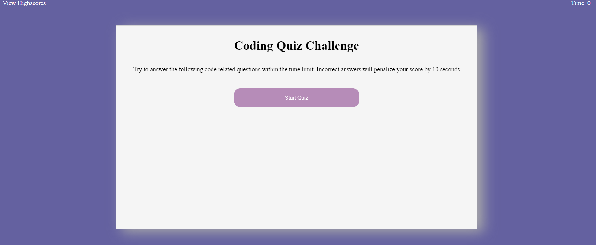
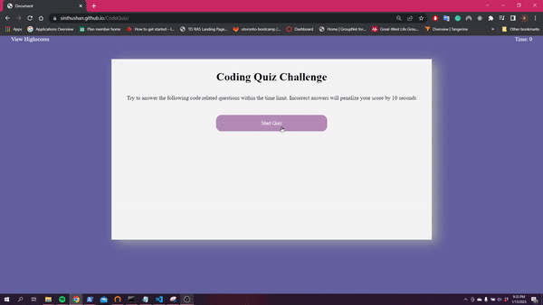

# Code Quiz

## Description

This is an online quiz to test your understanding of basic web development. Users will have 75 seconds to answer five questions. All wrong answers will result in a time penalty of 10 seconds. Once you completed the quiz you can add your score to the high score list. The list will be store in the local storage so you can come back any time to set a new record.

## Table of Contents

- [Installation](#installation)
- [Usage](#usage)
- [License](#license)

## Installation

There are no installation steps needed as the website only uses HTML and CSS and core javascript

## Usage

To view the website you can either go to: [Code Quiz Website](https://sinthushan.github.io/CodeQuiz)

or

You can clone the repository using: `git clone git@github.com:sinthushan/CodeQuiz.git`
Once cloned open up the index.html file in a web browser to see the final product

### steps

* To start the quiz press the start button 
* Once the the start button is clicked, the time will start. For each question you will have 4 options
* Once you complete the five questions the timer will stop and you will be shown the results page with your score where you can enter your initials and have your score added to the highscore list.
* If you choose to add your score you will be shown you score along with your previous scores that you added to the highscore list
* this high score list can be viewed at any time by click the View Highscores link at the top
* If you choose the Clear High Scores button all existing scores will be removed from local storage

## License

MIT License
